# UNIVERSIDAD DE SAN CARLOS DE GUATEMALA
# REDES DE COMPUTADORAS 1
# PRACTICA 1 
## Catedrático: Ing. Pedro Pablo Hernández Ramírez
## Auxiliar: Melani López
## ALUMNO: Luis Mariano Moreira García
## CARNET: 202010770

 

## CONFIGURACIONES DE LAS VPCs:
### NIVEL2
Tenemos: 202010770 ultimos dos digitos: 70 y nivel 2  
#### OFICINA A
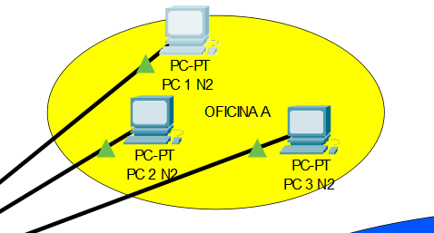 
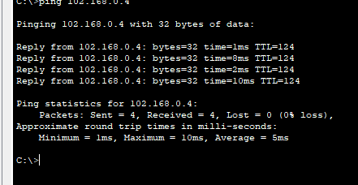 
#### OFICINA B
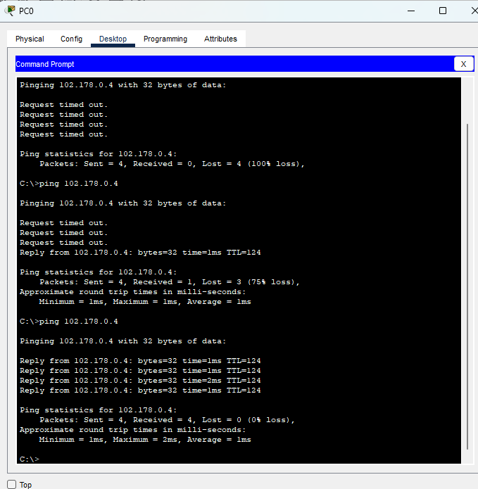 
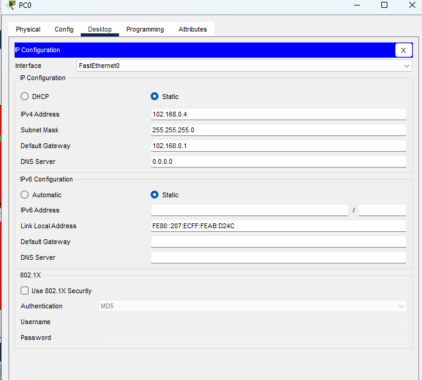 
#### OFICINA C
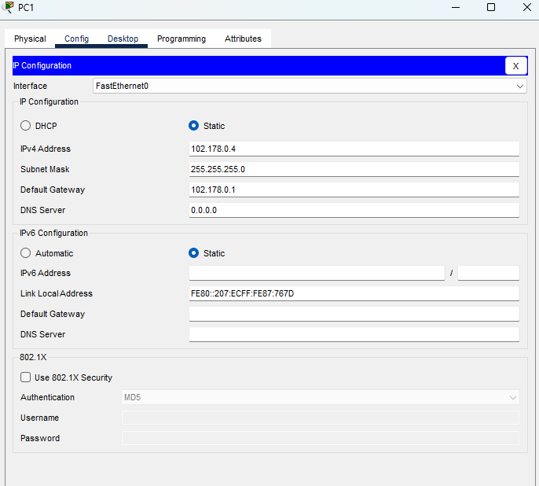 
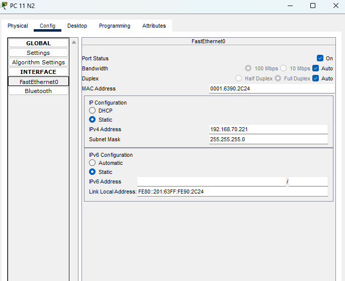 
### NIVEL1
Tenemos: 202010770 ultimos dos digitos: 70 y nivel 1  
#### AREA ADMINISTRACIÓN
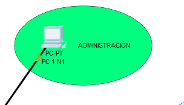 
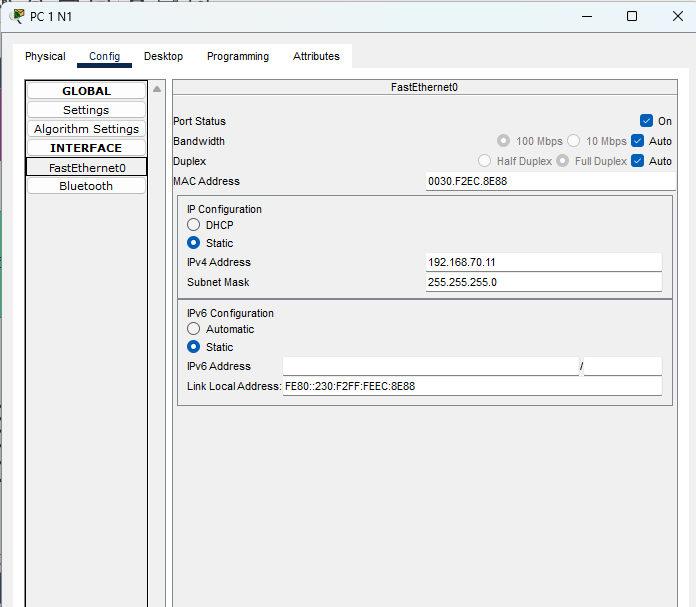 
#### AREA RECURSOS HUMANOS
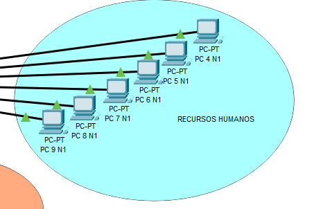 
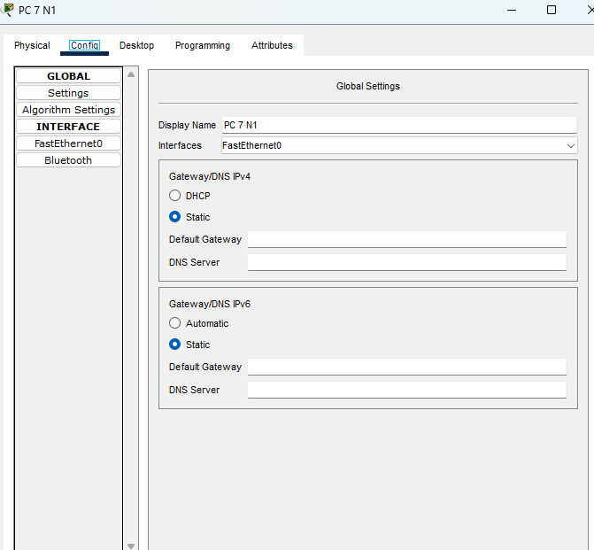 
#### ATENCIÓN AL CLIENTE
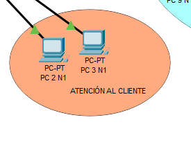 
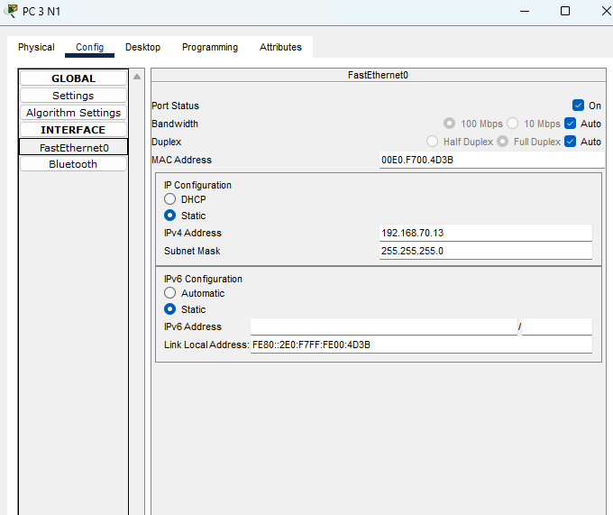 
#### GERENCIA
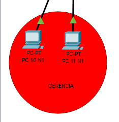 
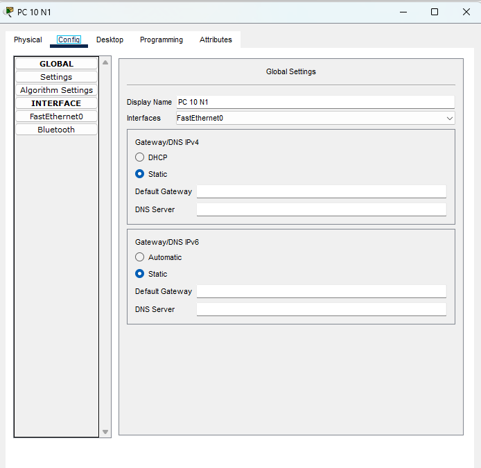 

## PINGS ENTRE LOS HOSTS:
Se hará la conexión:  
DESDE: PC 2 N1 en el area de atención al cliente Nivel 1 
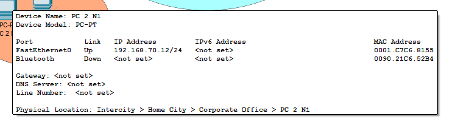 
HASTA: PC 5 N2 en la oficina B Nivel 2 
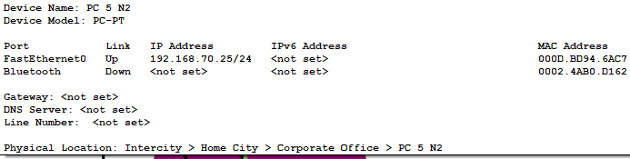 
RESULTADO:  
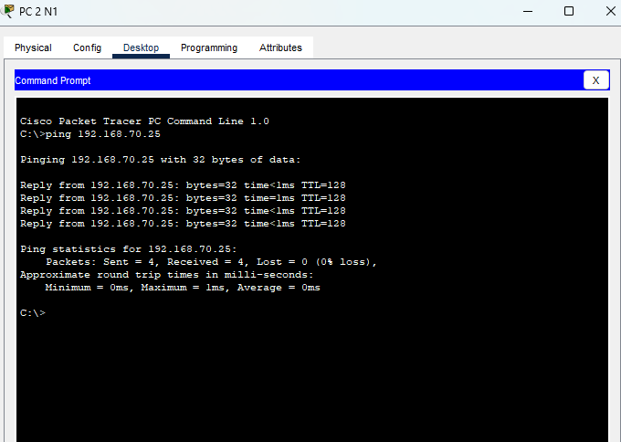 

Se hará la conexión:  
DESDE: PC 5 N1 en el area de recursos humanos Nivel 1 
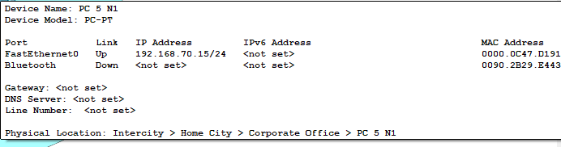 
HASTA: PC 9 N1 en el area de recursos humanos Nivel 1 
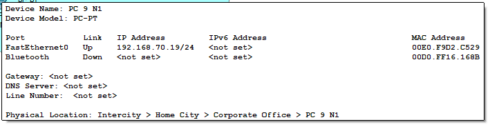 
RESULTADO:  
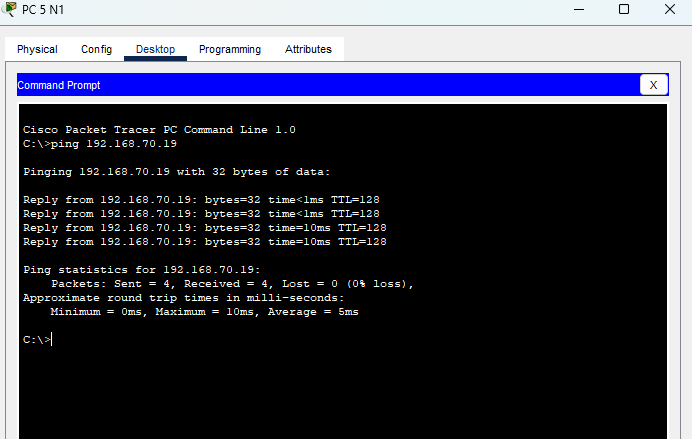 

Se hará la conexión:  
DESDE: PC 1 N2 en la oficina A Nivel 2 
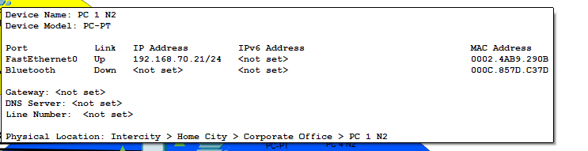 
HASTA: PC 10 N1 en el area de Gerencia Nivel 1 
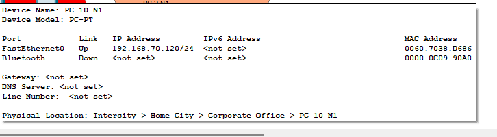 
RESULTADO:  
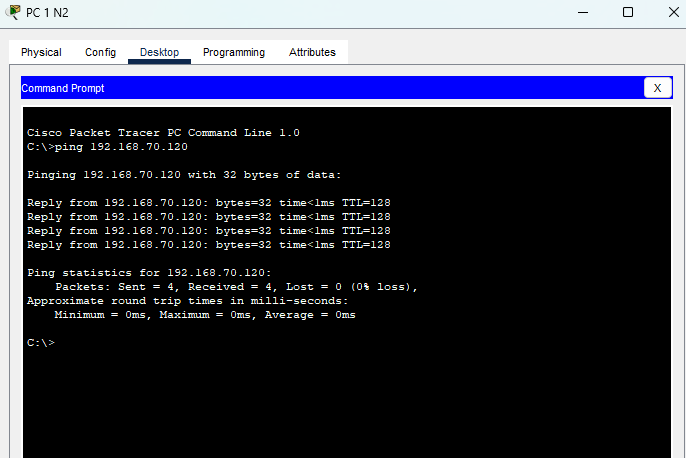 

## CAPTURA DE PAQUETES ARP/ICMP:
Desde PC 10 N2 que se ubica en la oficina c HACIA PC 1 N1 que se ubica en administracion en el primer nivel  
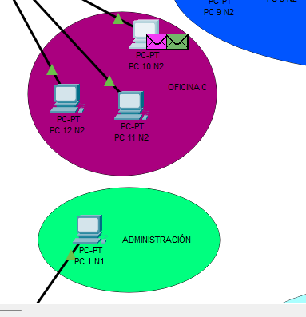 
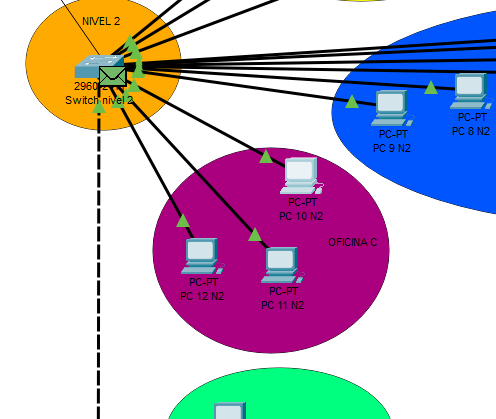 
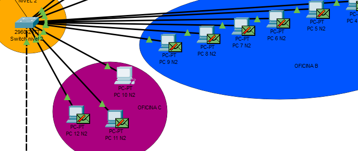 
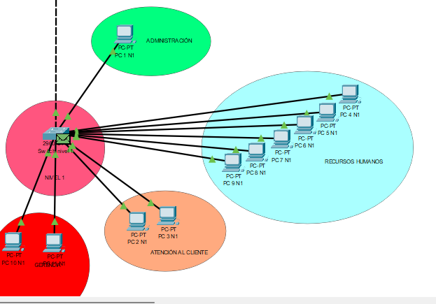 
Se encontro.  
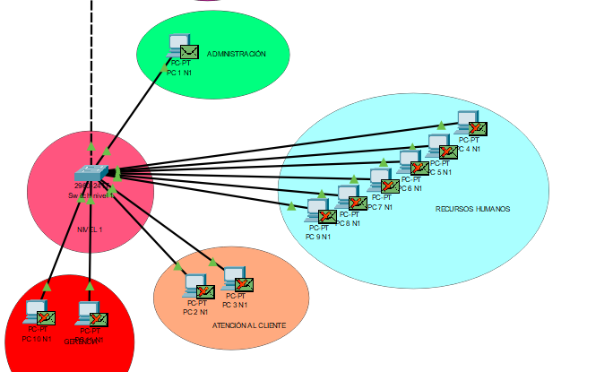 
Transmision de paquetes exitosa.  
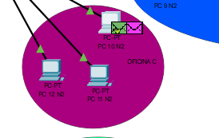 